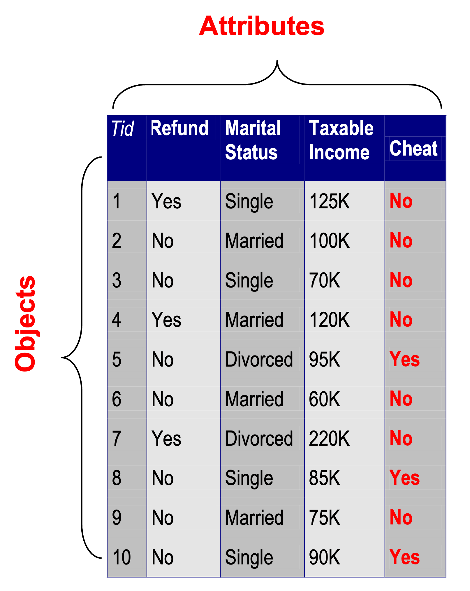
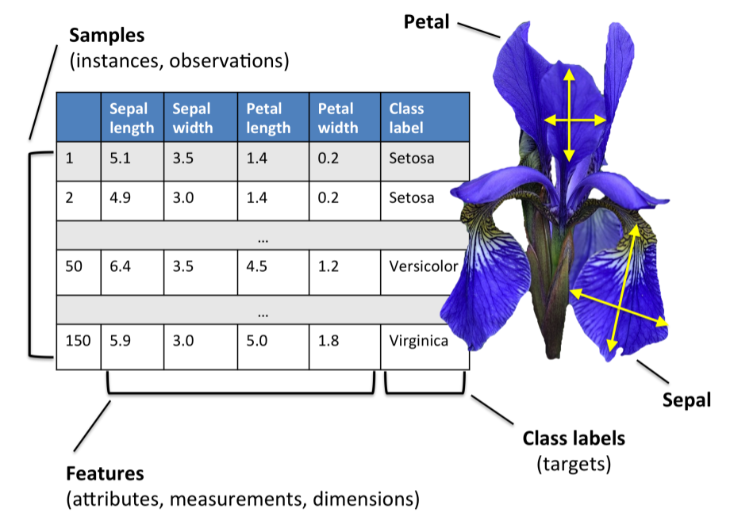
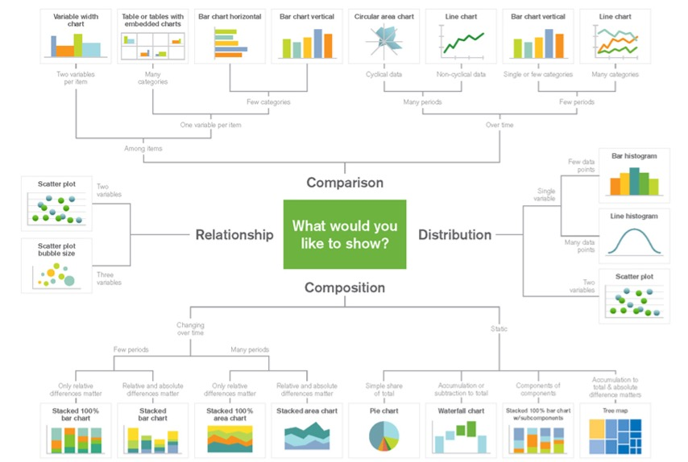
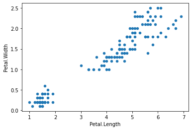
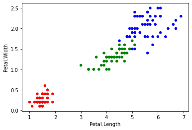

<!-- _class: lead -->

# Basic Data Mining with Python
Webinar
CSC649 (Special Topics in Computer Science)

---
<!-- paginate: true -->
<!-- footer: Webinar CSC649, UiTM Cawangan Terengganu, Kampus Kuala Terengganu -->

# Presenter

**Pradeep Isawasan** currently a senior lecturer in College of Computing, Informatics and Media, Universiti Teknologi MARA (UiTM), Perak Branch, Tapah Campus.  

- [YouTube](https://www.youtube.com/@teknodip)
- [TikTok](https://www.tiktok.com/@datadeep)
- [GitHub](https://github.com/pradeep-isawasan)
- [Kaggle](https://www.kaggle.com/pradeepisawasan)
- [Google Scholar](https://scholar.google.com.my/citations?hl=en&user=aHws58EAAAAJ&view_op=list_works&sortby=pubdate)

---
# What is Data Mining?
#### Many Definitions

- Non-trivial extraction of implicit, previously unknown and potentially useful information from data
- Exploration & analysis, by automatic or semi-automatic means, of large quantities of data in order to discover meaningful patterns 

_Data Mining is a process of extracting insights from data._

---
# What is Data?

- Collection of data objects and attributes

- An attribute is a property or characteristics of an object

- A collection of attributes describe an object



---
# The Data Mining Process
For today's talk, we make it simple by seperating the process into

**Part 1: Data Preprocessing**
- Cleaning, transforming, visualizing

**Part 2: Machine Learning**
- Create model, train, test, evaluate, use


---
# Technology/Tools
**Programming Language**
_Python, R_

**Software**
_Weka, RapidMiner, Excel_

**Cloud**
_R Studio Cloud, Power BI, Tableau, Google Collab_

---

# Programming Language
#### What is Python?

- High-Level Programming Language.
- Emphasizes on code readibilty.
- Rank = 1* for 2021 *[(IEEE Spectrum)](https://spectrum.ieee.org/top-programming-languages/)
- Consist of fantastic libraries!

---

<!-- _class: lead -->

# Part I: Preprocessing

---

# Python Library
#### Pandas for Data Analysis and Manipulation
A Python library is a collection of related modules. It makes Python programming simpler and convenient for the programmer. 
```py
# importing Pandas library
import pandas as pd
```
Pandas is the backbone of most python data mining projects.

---
# Reading Data

Usually we can use pandas library. Pandas store the imported data as DataFrame.

```py
# Default sep = ','
df = pd.read_csv("iris_dirty.csv")
```
or if you want to use another separator, simply add sep='\t'

```py
df = pd.read_csv("file_name.csv", sep = '\t')
```

---
# Iris Flower Dataset
- Also known as Fisher's Iris dataset 
- Introduced by Ronald Fisher in his 1936 paper. 



---

# View Data

You can have a look at the first five rows with .head():

```py
# by default is 5 rows
df.head()
# you can also customize the #-rows 
df.head(10)
```
or the last five rows with .tail():

```py
df.tail()
```

---

# Data Info

The shape property returns the dimensionality of the DataFrame. 

```py
df.shape
```

The info() method prints information about the DataFrame. 

```py
df.info
```

---

# Statistical Description

All standard statistical operations are present in Pandas:

```py
# Show the statistical summary on the numerical columns
df.describe()
# or individually
df.mean()
```


```py
# Show the statistical summary on the categorical columns
df.describe(include = 'object')
```
---

# Data Cleaning
##### Finding Missing Values

It is common to have not-a-number (NaN) values in your data set. 

```py
# Will give the total number of NaN in each column
df.isna().sum()
```

---
# Data Cleaning
#### Handling Missing Values

```py
# Remove the rows with NaN, not recommended
df.dropna() 
```
```py
# fill NaN with 0, also not recommended
df.fillna(0) 

# fill NaN with mean, better
df1 = df.fillna(df.mean(numeric_only=True)) 
```

---

# Data Cleaning
#### Problematic Values

Typo can be considered problematic.

```py
# Count unique categorical values
df1.Species.unique()
df1['Species'].value_counts()

# View problematic values
df1.iloc[[7]]
```

---

# Data Cleaning
##### Handling Problematic Values

We can replace with the correct value using replace()

```py
df2 = df1.replace(['SETSA'],'setosa')
```

Cleaning done! 

Check out my [Kaggle post](https://www.kaggle.com/code/pradeepisawasan/handling-unusual-values) for more data cleaning example.

---

# Data Visualization

Why?
- Visualizing data prior to analysis is a good practice. 
- Statistical description do not fully depict the data set in its entirety.

Check out my video [HERE](https://youtu.be/Ftf3jDcMlGw) explaining the importance of visualizing data when analyzing it.

---

# Cheat Sheet



---

# Data Visualization

Scatter plot

```py
df2.plot.scatter(x = 'Petal.Length', y = 'Petal.Width')
```
Using colour as third variable

```py
# Dictionary mapping colour with categorical values
colors = {'setosa':'red','virginica':'blue','versicolor':'green'}

df2.plot.scatter(x = 'Petal.Length', y = 'Petal.Width', c = df2['Species'].map(colors))
```

---

# Data Visualization
##### What do you see?

 

---

<!-- _class: lead -->

# Part II: Machine Learning (ML)

---

# Performing Classification

When you look at the petal measurements of the three species , what do you see? 

- _It’s pretty obvious to us humans that virginica has larger petals than versicolor and setosa. But machine cannot understand like we do. It needs some algorithm to do so._

For that, we need to implement an algorithm that is able to classify the iris flowers into their corresponding classes.

---

# Python Library
#### scikit-learn for Machine Learning

Scikit-learn provides various tools for model fitting, model selection, model evaluation, and many other utilities.

```py
# import built-in machine learning algorithms, for example Logistic Regression

from sklearn.linear_model import LogisticRegression
```


---

# Holdout Method

Randomly split the dataset into two sets; Training set and Test set

```py
from sklearn.model_selection import train_test_split

# Separate/Assign the attributes into (X) and target (y) 
X = df2.iloc[:, :-1]
y = df2.iloc[:, -1]

#split 80% training and 20 test
X_train, X_test, y_train, y_test = train_test_split(X, y, test_size=0.2)
```

---

# Algorithm

**Logistic Regression** is used to predict a categorical target , given a set of independent variables.

```py
# import Linear Regression
from sklearn.linear_model import LogisticRegression

# create model
model = LogisticRegression(max_iter=150)

# train model
model.fit(X_train, y_train)
```

---

# Evaluation
Model evaluation is the process of using different evaluation metrics to understand a machine learning model's performance.

```py
from sklearn import metrics
# Find accuracy
metrics.accuracy_score(y_test, y_pred)
```

```py
#Find confusion matrix
metrics.confusion_matrix(y_test, y_pred)
```

Check out my video *[HERE](https://youtu.be/XwMlUv7OSJw) on how to calculate confusion matrix.

---
# Finally!
Our model ready to be used.

```py
# Lets create a new data
data = {'Sepal.Length': [4.7], 'Sepal.Width': [3.1], 'Petal.Length': [1.7], 'Petal.Width': [0.3]}

newdf = pd.DataFrame(data)
```

```py
# Now we can predict using our model
ynew = model.predict(newdf)
```


---
# Next?

**Can we have a better classifier performance?**
- Normalizing, scaling, feature selection, cross-validation, etc.

**Which algorithm is better?**
- [Neural Network?](https://youtu.be/-uenFyHqOsM), Check out my video on perceptron

**How to apply?**
- create a _"machine learning"_ capable web/mobile-based system

---
# Learning  Materials

**Textbook**
- [Introduction to Data Mining](https://www-users.cse.umn.edu/~kumar001/dmbook/index.php)


**Practical Books**
- [Python for Data Analysis](https://www.amazon.com/gp/product/1491957662?tag=javamysqlanta-20)
- [Machine Learning with Python Cookbook](https://www.amazon.com/gp/product/1491989386?tag=javamysqlanta-20)

